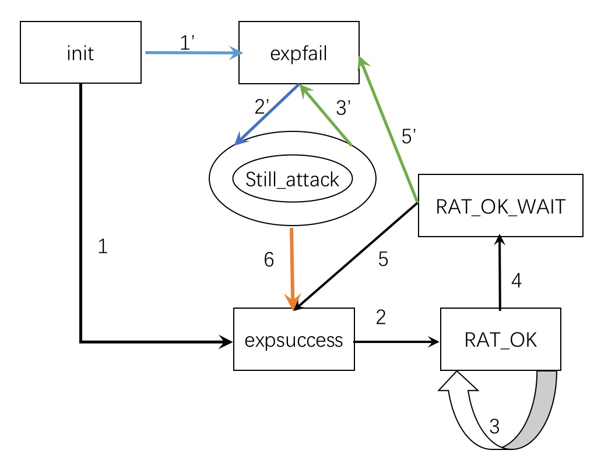

# AutoRED: AWD exploit 攻击框架

> 主要功能：
>
> 1. 批量攻击
> 2. 注入内存木马，反弹flag
> 3. 攻击结果反馈

### 主要模块

| 模块         | 功能概述                                             |
| ------------ | ---------------------------------------------------- |
| exp.py       | 原始exp，要求拥有可以起一个shell                     |
| sqltool.py   | 一些数据库操作函数                                   |
| submitter.py | flag提交函数                                         |
| monitor.py   | 主要程序，维持一个可视化的反馈界面，各个进程启动脚本 |

### 设计思想

舍弃进程间的通信，选用数据库来实现各个进程间的配合。

目前建表，表名称：awd

column: ip,status,flag,ticks

ip:		攻击对象

status:	目标状态[ init|expfail|expsuccess|RAT_OK|RAT_OK_WAIT ]

flag:	反馈的flag[none|{flag}|FLAG_WAIT]

ticks:	计数攻击ip处于RAT_OK_WAIT节拍数，如果ticks超过阈值，表明内存马挂了，p_keepit再次打出exp

攻击状态机：

最顺利的情况:1>2>3

exp失败: 1'>2'>3'>2'>3'>...

木马被杀: 4>5'>2‘>6 或者4>5>2>3或者4>5'>2'>3'

* p_scan.start()：批量打
* p_recv.start()：接收返回的flag
* p_heartbeat.start()：内存木马心跳

* p_keepit.start()：如果心跳停止，打一发exp

* p_stillattack.start()：选择被标记为expfail的目标，固定间隔发送exp尝试，直到目标expsucceed
* 主进程：每间隔一定的节拍，从数据库读入目标状态和flag，打印到控制台，便于反馈信息

### 使用方法

1. 改写exp.py
2. 配置monitor.py中攻击目标端口
3. 增加iplist.txt
4. 配置内存马rat.py中的参数

> Ps: testserver.py用来模拟内存木马的行为

